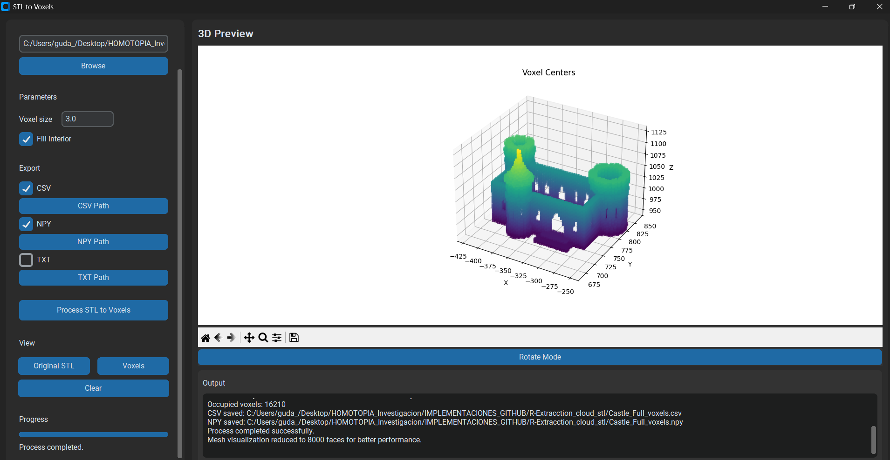
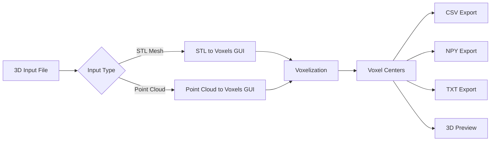
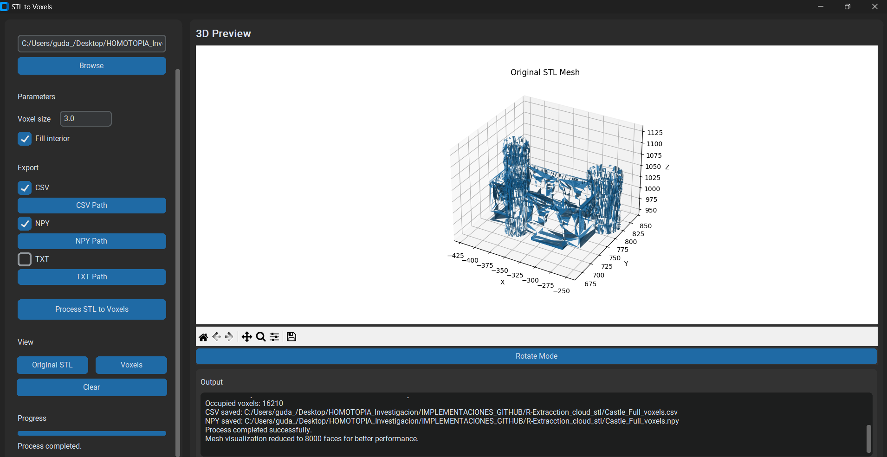
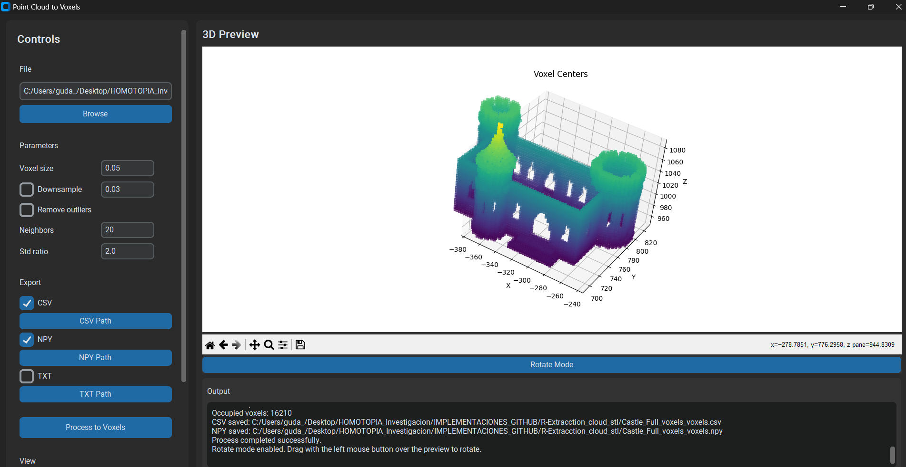

# 3D Voxelization GUI

<p align="center">
  
</p>

<p align="center">
  <b>Graphical Python tools for converting STL models and point clouds into voxel center coordinates.</b>
</p>

<p align="center">
  
  
  
  
  
</p>

---

## Overview

**3D Voxelization GUI** is a Python desktop application for converting 3D geometric data into voxel center coordinates.

The project includes two graphical tools:

1. **STL to Voxels GUI**  
   Converts `.stl` mesh models into voxel centers.

2. **Point Cloud to Voxels GUI**  
   Converts point cloud files into voxel centers.

The output can be exported as:

- `.csv`
- `.npy`
- `.txt`

This project is useful for 3D model discretization, spatial analysis, robotic path planning, occupancy grid generation, and point cloud preprocessing.

---

## Workflow



---

## STL to Voxels GUI

The **STL to Voxels GUI** allows the user to load a 3D mesh in `.stl` format and convert it into voxel centers.

<p align="center">
  
</p>

### Main features

- Load `.stl` files.
- Visualize the original STL mesh.
- Define the voxel size.
- Fill the interior of the voxelized model.
- Generate voxel centers.
- Export results to `.csv`, `.npy`, or `.txt`.
- Preview the voxelized result in 3D.

<p align="center">
  
</p>

### Run STL to Voxels

```bash
python src/GUI_stl_csv_v2.py
```

---

## Point Cloud to Voxels GUI

The **Point Cloud to Voxels GUI** allows the user to convert point cloud data into voxel centers.

<p align="center">
  
</p>

### Supported input formats

- `.ply`
- `.pcd`
- `.xyz`
- `.xyzn`
- `.xyzrgb`
- `.pts`
- `.csv`
- `.txt`

### Main features

- Load point cloud files.
- Visualize the point cloud.
- Define the voxel size.
- Optional downsampling.
- Optional statistical outlier removal.
- Generate voxel centers.
- Export results to `.csv`, `.npy`, or `.txt`.
- Preview the voxelized result in 3D.

### Run Point Cloud to Voxels

```bash
python src/GUI_cloud_v4.py
```

---

## Output format

The exported `.csv` file contains the voxel center coordinates and the voxel size:

```csv
x,y,z,voxel_size
-375.0,702.0,960.0,3.0
-372.0,702.0,960.0,3.0
-369.0,702.0,960.0,3.0
```

The `.npy` file stores a Python dictionary with the following structure:

```python
{
    "centers": numpy.ndarray,
    "voxel_size": float,
    "count": int
}
```

Where:

- `centers`: array containing the voxel center coordinates.
- `voxel_size`: voxel size used during the conversion.
- `count`: total number of generated voxels.

---

## Repository structure

```text
3D-Voxelization-GUI/
│
├── README.md
├── LICENSE
├── requirements.txt
├── .gitignore
│
├── src/
│   ├── GUI_cloud_v4.py
│   └── GUI_stl_csv_v2.py
│
├── examples/
│   ├── Castle_Full.stl
│   ├── output_voxels_castle.csv
│   └── Castle_Full_voxels.npy
│
└── docs/
    └── images/
        ├── stl_to_voxels_original.png
        ├── stl_to_voxels_result.png
        └── pointcloud_to_voxels.png
```

---

## Installation

Clone the repository:

```bash
git clone https://github.com/Guda108/3D-Voxelization-GUI.git
cd 3D-Voxelization-GUI
```

Create a virtual environment.

### Windows

```bash
python -m venv venv
venv\Scripts\activate
```

### Linux/macOS

```bash
python3 -m venv venv
source venv/bin/activate
```

Install the required packages:

```bash
pip install -r requirements.txt
```

---

## Requirements

Recommended Python version:

```text
Python 3.11
```

Python 3.11 is recommended because the point cloud application uses `Open3D`.

Required packages:

```text
numpy
pandas
matplotlib
customtkinter
open3d
trimesh
pyinstaller
```

---

## Building standalone executables

The project can be packaged as a standalone desktop application using `PyInstaller`.

### Windows - Point Cloud to Voxels

```bash
pyinstaller --noconfirm --clean --windowed --onefile --name PointCloud_to_Voxels --collect-all open3d --collect-all customtkinter --collect-all matplotlib --collect-all pandas src/GUI_cloud_v4.py
```

### Windows - STL to Voxels

```bash
pyinstaller --noconfirm --clean --windowed --onefile --name STL_to_Voxels --collect-all trimesh --collect-all customtkinter --collect-all matplotlib src/GUI_stl_csv_v2.py
```

### Linux - STL to Voxels

```bash
pyinstaller --noconfirm --clean --windowed --onefile \
  --name STL_to_Voxels \
  --collect-all trimesh \
  --collect-all customtkinter \
  --collect-all matplotlib \
  src/GUI_stl_csv_v2.py
```

The generated executable will be located inside the `dist/` folder.

---

## Example files

This repository includes example files for testing the voxelization process:

```text
examples/Castle_Full.stl
examples/output_voxels_castle.csv
examples/Castle_Full_voxels.npy
```

These files can be used to test the conversion from an STL mesh to voxel center coordinates.

---

## Applications

This tool can be useful for:

- 3D model discretization.
- Voxel-based spatial analysis.
- Robotic path planning.
- Occupancy grid generation.
- Point cloud preprocessing.
- Digital manufacturing workflows.
- Additive manufacturing research.
- Computational geometry.
- Engineering education and visualization.

---

## Suggested citation

If this project is useful for academic or research purposes, please cite it as:

```text
G. Diaz, 3D Voxelization GUI: Graphical Python tools for converting STL models and point clouds into voxel center coordinates, GitHub repository, 2026.
```

---

## Author

**Gerardo Diaz**

Researcher and developer working on robotics, 3D processing, electronics, and computational tools for engineering applications.

---

## License

This project is licensed under the MIT License.